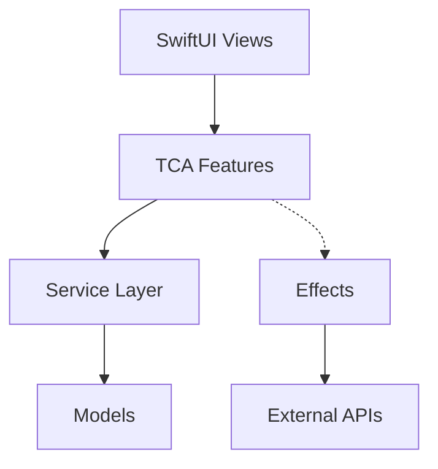

# PokemonSearch

## Overview

This project is a **TCA (The Composable Architecture) learning sample application**. It aims to help developers catch up on essential elements needed when introducing TCA to real projects:

- **Architecture Logic**: TCA basic patterns and best practices
- **Coding Style**: Swift coding conventions and TCA-specific patterns
- **CI/CD**: Test, build, and deployment automation patterns
- **Project Structure**: Maintainable directory structure and modular design
- **Network Layer**: Reusable API communication abstraction
- **Error Handling**: Error handling and logging strategies

## TCA Architecture

## Features

### 🔍 Pokemon Search App

This app uses [PokeAPI](https://pokeapi.co/) and provides the following features:

#### Main Features
- **Pokemon List**: Display list of Pokemon
- **Detail View**: Pokemon details (types, abilities, moves, etc.)
- **Favorites**: Offline-capable favorites management

## Tech Stack

- **Language**: Swift 6.0
- **UI Framework**: SwiftUI (iOS 17.0+)
- **Architecture**: The Composable Architecture 1.20.2+
- **API**: [PokeAPI v2](https://pokeapi.co/api/v2/)
- **Testing**: XCTest with TestStore

## Learn More About TCA

For detailed TCA usage and best practices, refer to the official resources:

- **Official Documentation**: [The Composable Architecture](https://github.com/pointfreeco/swift-composable-architecture)
- **Point-Free**: [TCA Tutorial](https://www.pointfree.co/collections/composable-architecture)
- **API Reference**: [TCA Documentation](https://pointfreeco.github.io/swift-composable-architecture/main/documentation/composablearchitecture/)

---

💡 Through this project, you can acquire practical knowledge of TCA and iOS app development best practices.